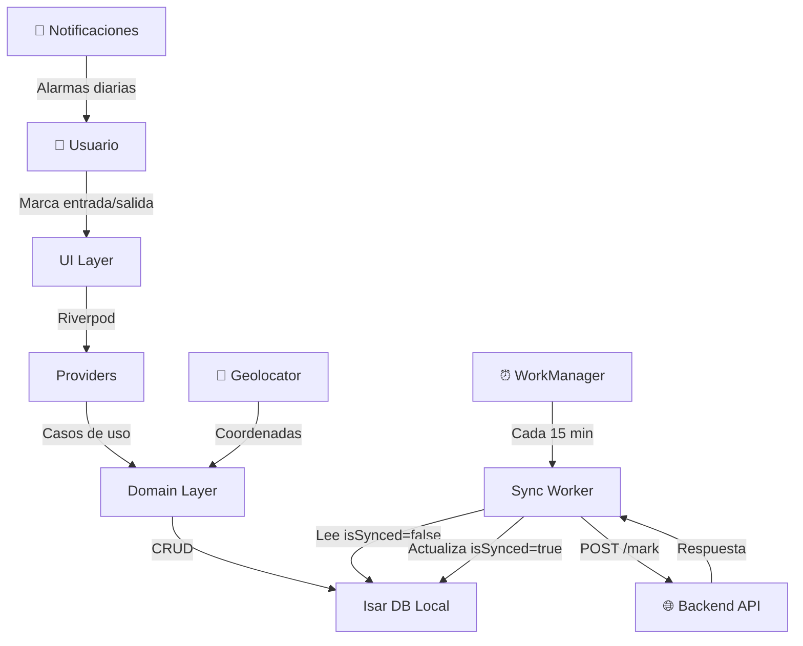

<p align="center">
  
</p>

<h1 align="center">📋 App Asistencias</h1>

<p align="center">
  <strong>Aplicación móvil de control de asistencias y gestión de actividades de personal</strong>
</p>

<p align="center">
  
  
  
  
  
</p>

---

## 📖 Descripción

**App Asistencias** es una aplicación móvil desarrollada en **Flutter** para la gestión integral de asistencias del personal de **FrioTeam**. Permite registrar entradas y salidas, gestionar actividades por tipo de tarea (oficina, taller, servicio, transporte), crear asignaciones, tomar notas y generar reportes — todo con una arquitectura **Offline-First** que garantiza el funcionamiento sin conexión a internet.

### ✨ Características Principales

| Funcionalidad                          | Descripción                                                                 |
| -------------------------------------- | --------------------------------------------------------------------------- |
| 🕐 **Control de Asistencia**           | Registro de entradas/salidas con modelo de sesión unificada y token offline |
| 📍 **Geolocalización**                 | Captura automática de coordenadas GPS al marcar asistencia                  |
| 🔔 **Alarmas y Recordatorios**         | Notificaciones programadas (06:00 AM y 08:00 PM) con alarma full-screen     |
| 📴 **Modo Offline**                    | Operación completa sin conexión; sincronización automática al recuperar red |
| 🔄 **Sincronización en Segundo Plano** | WorkManager ejecuta tareas de sync cada 15 minutos                          |
| 📝 **Notas y Asignaciones**            | Creación de notas por actividad y asignación de tareas a colaboradores      |
| 📊 **Historial de Actividades**        | Consulta detallada del historial con filtros y estados                      |
| 👤 **Gestión de Perfil**               | Visualización de datos del usuario y zona asignada                          |
| 📸 **Captura de Fotos**                | Toma y adjunto de evidencia fotográfica                                     |
| 🔐 **Autenticación con Token**         | Login seguro con manejo de sesión persistente                               |

---

## 🏗️ Arquitectura

```
lib/
├── core/                   # Infraestructura base
│   ├── database.dart       # Singleton de Isar Database
│   ├── enpoinService.dart   # Cliente HTTP (Dio) con interceptores
│   ├── notification_service.dart  # Alarmas y notificaciones locales
│   ├── sync_worker.dart    # Worker de sincronización en background
│   └── permission_guard.dart  # Gestión de permisos del sistema
│
├── models/                 # Esquemas de BD (Isar) y DTOs
│   ├── activity/           # Modelo de actividad/asistencia
│   ├── user/               # Modelo de usuario
│   ├── assigment_model.dart
│   ├── client_model.dart
│   ├── collaborator_model.dart
│   ├── note_model.dart
│   └── report_model.dart
│
├── domain/                 # Casos de uso y lógica de negocio
│   ├── activity/           # Crear, obtener, registrar actividades
│   ├── assignment/         # Gestión de asignaciones
│   ├── auth/               # Login y sesión
│   ├── client/             # Clientes
│   ├── collaborator/       # Colaboradores
│   ├── connectivity/       # Estado de red
│   ├── note/               # Notas
│   └── session/            # Almacenamiento de sesión activa
│
├── providers/              # State Management (Riverpod)
│
├── ui/                     # Capa de presentación
│   ├── screens/            # Pantallas principales
│   │   ├── home/           # Dashboard principal
│   │   ├── login_screen.dart
│   │   ├── history_screen.dart
│   │   ├── profile_screen.dart
│   │   ├── reminder_screen.dart
│   │   └── create_assignment_view.dart
│   ├── sheets/             # Bottom sheets
│   └── widgets/            # Widgets reutilizables
│
└── main.dart               # Punto de entrada
```

### Diagrama de Flujo de Datos



---

## 🛠️ Stack Tecnológico

| Tecnología                      | Uso                                           |
| ------------------------------- | --------------------------------------------- |
| **Flutter 3.22.3**              | Framework UI multiplataforma                  |
| **Dart ≥3.4.4**                 | Lenguaje de programación                      |
| **Isar 3.1.0**                  | Base de datos local NoSQL de alto rendimiento |
| **Dio 5.9.0**                   | Cliente HTTP con interceptores para tokens    |
| **Riverpod 2.5.1**              | Gestión de estado reactiva                    |
| **GoRouter 15.1.2**             | Navegación declarativa                        |
| **WorkManager 0.7.0**           | Tareas en segundo plano (sync)                |
| **Geolocator 13.0.2**           | Servicios de ubicación GPS                    |
| **Flutter Local Notifications** | Notificaciones y alarmas programadas          |
| **SharedPreferences**           | Almacenamiento clave-valor (sesión, token)    |
| **FVM**                         | Gestión de versiones de Flutter               |

---

## 🚀 Instalación y Configuración

### Prerrequisitos

- **FVM** (Flutter Version Management)
- **Android SDK** (API Level 34+)
- **Android Studio** o **VS Code** con extensiones de Flutter/Dart

### Pasos

1. **Clonar el repositorio**

```bash
git clone https://github.com/FrioPedro/App-Asistencias.git
cd App-Asistencias
```

2. **Instalar FVM** (si no lo tienes)

```bash
dart pub global activate fvm
```

> 💡 **Windows:** Agregar `%USERPROFILE%\AppData\Local\Pub\Cache\bin` al PATH del sistema.

3. **Instalar la versión de Flutter requerida**

```bash
fvm install 3.22.3
fvm use 3.22.3
```

4. **Instalar dependencias**

```bash
fvm flutter pub get
```

5. **Generar código de Isar** (esquemas de base de datos)

```bash
fvm flutter pub run build_runner build --delete-conflicting-outputs
```

6. **Configurar Isar SDK** (necesario para compilar)

Abrir el archivo de build de Isar y ajustar `compileSdkVersion`:

```bash
# Windows
notepad "%LOCALAPPDATA%\Pub\Cache\hosted\pub.dev\isar_flutter_libs-3.1.0+1\android\build.gradle"
```

Establecer:

```gradle
android {
    compileSdkVersion 35
}
```

7. **Ejecutar la aplicación**

```bash
fvm flutter run
```

---

## 📱 Pantallas Principales

| Pantalla             | Descripción                                            |
| -------------------- | ------------------------------------------------------ |
| **Login**            | Autenticación con credenciales de empresa              |
| **Home / Dashboard** | Vista principal con acciones rápidas de entrada/salida |
| **Historial**        | Registro cronológico de todas las actividades          |
| **Crear Asignación** | Formulario para asignar tareas a colaboradores         |
| **Recordatorios**    | Gestión de alarmas de trabajo                          |
| **Perfil**           | Información del usuario y zona asignada                |

---

## 🔄 Modelo de Sesión Unificada

La app utiliza un modelo innovador de **sesión unificada** con token offline:

- **Un solo registro** en la base de datos representa toda la sesión de trabajo (entrada + salida).
- Se genera un **token local único** (`SESS-{timestamp}-{random}`) al marcar entrada, sin depender del servidor.
- La **salida actualiza** el mismo registro en vez de crear uno nuevo.
- El **sync envía dos eventos** (entrada y salida) al backend usando el mismo token como vinculador.

> Esto garantiza consistencia incluso con conectividad inestable, eliminando registros huérfanos.

---

## ⚙️ Comandos Útiles

```bash
# Instalar dependencias
fvm flutter pub get

# Generar/regenerar esquemas de BD
fvm flutter pub run build_runner build --delete-conflicting-outputs

# Modo watch (regeneración automática al guardar)
fvm flutter pub run build_runner watch

# Verificar entorno Flutter
fvm flutter doctor -v

# Ejecutar la app en modo debug
fvm flutter run

# Compilar APK de release
fvm flutter build apk --release
```

---

## 🤝 Contribución

1. Crear una rama desde `main`:
   ```bash
   git checkout -b feature/mi-feature
   ```
2. Hacer commit de los cambios:
   ```bash
   git commit -m "feat: descripción del cambio"
   ```
3. Hacer push de la rama:
   ```bash
   git push origin feature/mi-feature
   ```
4. Abrir un **Pull Request** describiendo los cambios.

---

## 📄 Documentación Adicional

- [`INTERNAL_FUNCTIONALITY.md`](INTERNAL_FUNCTIONALITY.md) — Documentación técnica interna del proyecto
- [`UNIFIED_SESSION_IMPLEMENTATION.md`](UNIFIED_SESSION_IMPLEMENTATION.md) — Detalle de la arquitectura de sesión unificada

---

<p align="center">
  Desarrollado con ❤️ por <strong>FrioTeam</strong>
</p>
